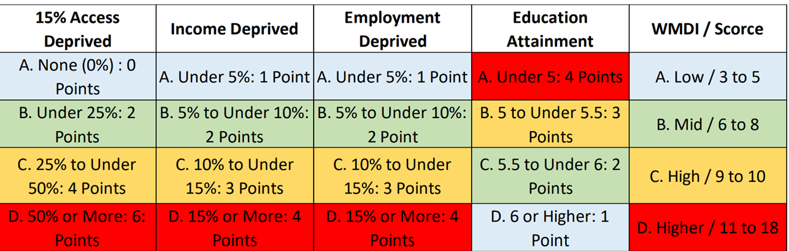

# Working Mobility Deprivation Index Expansion

This code is to expand work completed by the Edinburgh and South Scotland City Region Deal Project to calculate a Scotland-wide Working Mobility Deprivation Index.

It is made up of four components (as defined in the original project):

| Component                                         | Definition                                                                                                                                        |
|-------------------|-----------------------------------------------------|
| People living in 15% most 'access deprived' areas | Number and percentage of population living in 15% most 'access deprived' areas (data zones) in Scotland. Source: SIMD2020                         |
| Population income deprived                        | Number and percentage of total population classified as income deprived within SIMD income domain. Source: SIMD2020                               |
| Working age population employment deprived        | Number and percentage of working age population (16-64 years) classified as employment deprived within SIMD income domain. Source: SIMD2020       |
| Educational attainment of school leavers          | The score is based on school leavers' highest level of qualification, averaged across all leavers within a data zone. Sources: Statitics.gov.scot |

## Data

### SIMD 2020v2 Indicator Data

Raw data for the three components (Attainment, Income, and Employment) are available [here](https://www.gov.scot/publications/scottish-index-of-multiple-deprivation-2020v2-indicator-data/) as part of SIMD 2020v2. The following dataset variables are required:

| Variable               | Description                                                    |
|--------------------|----------------------------------------------------|
| Total_population       | 2017 NRS small area population                                 |
| Working_age_population | 2017 NRS small area population estimates and state pension age |
| Income_count           | Number of people who are income deprived                       |
| Employment_count       | Number of people who are employment deprived                   |
| Attainment             | Attainment of school leavers                                   |

### SIMD 'Access To Services' Data

The last component - People living in 15% most 'access deprived' areas - is calculated by aggregating total DZ populations within the most deprived areas. 'Deprived Areas' can be derived from this [dataset](https://statistics.gov.scot/resource?uri=http%3A%2F%2Fstatistics.gov.scot%2Fdata%2Fscottish-index-of-multiple-deprivation) (filter by: Simd Domain = Access to Services, and MeasureType = vigintiles). Since the DZs in this dataset are allocated to 20 ranked segments of deprivation, we can assume that the 3 most deprived segments equate to 15% most deprived areas.

# Scripts

### 1.calculate-access-deprived-population.R

-   Reads in *Total_population* variable from the SIMD dataset
-   Reads in Access to Services vigintiles.
-   Matches vigintiles to population by Data Zone code.
-   Categorical variable created: 'most_deprived' (for DZs in vigintile 1,2,3) and 'other' (for all other DZs).
-   Populations which fall in 'most_deprived' DZ are aggregated to IZ.

### 2.create-wmdi-component-dataset.R

-   Read in SIMD indiactor data and extract relevant variables
-   aggregate to IZ level (sum Employment_count, sum Income_count, mean Attainment)
-   join access deprived population by DZ Code
-   calculate rates:
    -   Employment_count / Working_age_population
    -   Income_count / Total_population\
    -   Access deprived population / Total_population
-   write final data to csv

### 3.calculate-wmdi-score.R

-   Read in clean WMDI data
-   Loop through data to populate new WMDI column with a Workorce Mobility Deprivation Index using a custom function (*worforce_mobility_index()*).

The *worforce_mobility_index()* function generates a workforce mobility deprivation 'score' for an Intermediate Zone by allocating (and summing) according to where each component figure exists in the scoring system below.

## WMDI Scoring System

